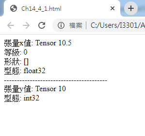
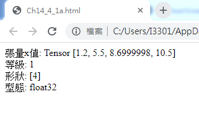

```
<!DOCTYPE html>
<html>
<head>
<meta charset="utf-8"/>
<title>Ch14_4_1.html</title>
<script src="https://cdn.jsdelivr.net/npm/@tensorflow/tfjs@latest"></script>
</head>
<body>
<script>
const x = tf.scalar(10.5);
document.write("張量x值: " + x + "<br/>");
document.write("等級: " + x.rank + "<br/>");
document.write("形狀: [" + x.shape + "]<br/>");
document.write("型態: " + x.dtype + "<br/>");
document.write("----------------------------------------<br/>");
const y = tf.scalar(10, "int32");
document.write("張量y值: " + y + "<br/>");
document.write("型態: " + y.dtype + "<br/>");
</script>
</body>
</html>
```

```
<!DOCTYPE html>
<html>
<head>
<meta charset="utf-8"/>
<title>Ch14_4_1a.html</title>
<script src="https://cdn.jsdelivr.net/npm/@tensorflow/tfjs@latest"></script>
</head>
<body>
<script>
const x = tf.tensor1d([1.2, 5.5, 8.7, 10.5]);
document.write("張量x值: " + x + "<br/>");
document.write("等級: " + x.rank + "<br/>");
document.write("形狀: [" + x.shape + "]<br/>");
document.write("型態: " + x.dtype + "<br/>"); 
</script>
</body>
</html>
```

